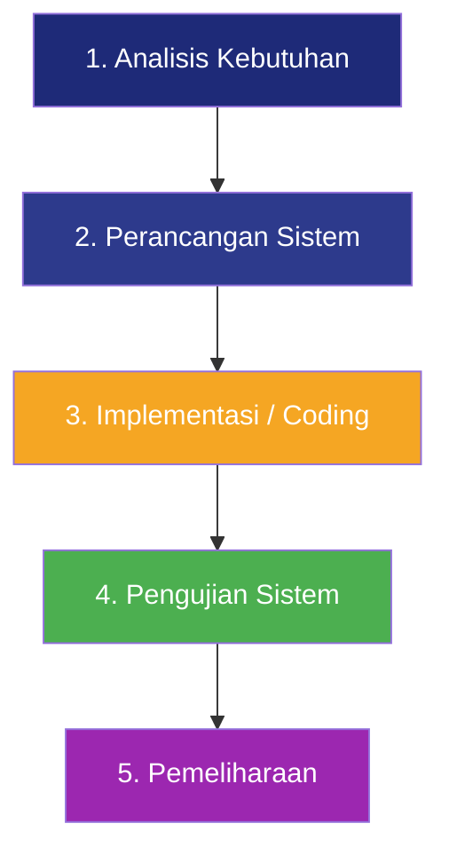

# BAB III — METODE PENELITIAN

## 3.1 Tempat dan Waktu Penelitian

### 3.1.1 Tempat Penelitian

Penelitian ini dilaksanakan di dua lokasi:

1. **Terminal Tipe-A Jatijajar Depok**
   Alamat: Jl. Raya Bogor KM 36, Jatijajar, Kecamatan Tapos, Kota Depok, Jawa Barat 16455.
   Terminal ini dipilih sebagai objek penelitian karena merupakan terminal bus tipe A yang melayani rute AKAP dan AKDP dengan volume penumpang tinggi, namun sistem pemesanan tiketnya masih dilakukan secara konvensional.

2. **Laboratorium Komputer / Tempat Tinggal Penulis**
   Proses perancangan, pengembangan (*coding*), dan pengujian sistem dilakukan secara mandiri oleh penulis menggunakan perangkat komputer pribadi.

### 3.1.2 Waktu Penelitian

Penelitian ini dilaksanakan selama **6 (enam) bulan**, dengan rincian jadwal sebagai berikut:

| No | Kegiatan | Bln 1 | Bln 2 | Bln 3 | Bln 4 | Bln 5 | Bln 6 |
|---|---|:---:|:---:|:---:|:---:|:---:|:---:|
| 1 | Pengajuan Proposal | ✅ | | | | | |
| 2 | Observasi & Pengumpulan Data | ✅ | ✅ | | | | |
| 3 | Analisis Kebutuhan Sistem | | ✅ | | | | |
| 4 | Perancangan Sistem (UML, ERD, UI) | | ✅ | ✅ | | | |
| 5 | Implementasi / Coding | | | ✅ | ✅ | | |
| 6 | Pengujian Sistem (Black Box) | | | | ✅ | ✅ | |
| 7 | Penulisan Laporan Skripsi | | | | | ✅ | ✅ |
| 8 | Sidang Skripsi | | | | | | ✅ |

## 3.2 Bahan dan Alat

### 3.2.1 Bahan Penelitian

Bahan yang digunakan dalam penelitian ini meliputi:

| No | Bahan | Keterangan |
|---|---|---|
| 1 | Data jadwal keberangkatan bus | Diperoleh dari observasi di Terminal Jatijajar |
| 2 | Data operator bus | Nama operator, rute, kelas bus, dan fasilitas |
| 3 | Data terminal tujuan | Nama terminal, kota tujuan |
| 4 | Data tarif / harga tiket | Harga tiket per rute dan per kelas bus |
| 5 | Data denah kursi bus | Layout kursi bus berdasarkan jenis/kelas bus |
| 6 | Literatur dan jurnal ilmiah | Referensi teori dan penelitian terdahulu |

### 3.2.2 Alat Penelitian

**a. Perangkat Keras (Hardware)**

| No | Perangkat Keras | Spesifikasi |
|---|---|---|
| 1 | Laptop / Komputer | Processor Intel Core i5 / AMD Ryzen 5, RAM 8 GB, SSD 256 GB |
| 2 | Mouse dan Keyboard | Standar |
| 3 | Printer | Untuk mencetak laporan dan dokumen |

**b. Perangkat Lunak (Software)**

| No | Perangkat Lunak | Fungsi |
|---|---|---|
| 1 | Windows 10 / 11 | Sistem operasi |
| 2 | XAMPP v8.2 | Web server lokal (Apache + MySQL) |
| 3 | Visual Studio Code | Text editor / IDE untuk menulis kode |
| 4 | Google Chrome | Browser untuk menguji tampilan website |
| 5 | PHP 8.2 | Bahasa pemrograman server-side |
| 6 | Laravel 12 | Framework PHP dengan arsitektur MVC |
| 7 | MySQL | Sistem manajemen basis data relasional |
| 8 | TailwindCSS | Framework CSS untuk desain antarmuka |
| 9 | Alpine.js | Library JavaScript untuk interaktivitas frontend |
| 10 | Composer | Dependency manager untuk PHP |
| 11 | Node.js & NPM | Build tool untuk kompilasi aset frontend |
| 12 | Git | Version control system |
| 13 | Draw.io / Lucidchart | Pembuatan diagram UML dan ERD |
| 14 | Chart.js | Library JavaScript untuk visualisasi grafik di dashboard admin |

## 3.3 Cara Kerja

Metode pengembangan sistem yang digunakan dalam penelitian ini adalah metode **Waterfall** (Pressman dan Maxim, 2015). Metode Waterfall dipilih karena kebutuhan sistem telah terdefinisi dengan jelas sejak awal dan proses pengembangannya bersifat sekuensial. Berikut adalah tahapan cara kerja dalam penelitian ini:

### 3.3.1 Tahap 1 — Analisis Kebutuhan (*Requirements Analysis*)

Pada tahap ini dilakukan pengumpulan data dan analisis kebutuhan sistem melalui tiga teknik:

**a. Observasi**
Penulis melakukan pengamatan langsung terhadap proses pemesanan tiket bus di Terminal Jatijajar Depok, meliputi alur pembelian tiket di loket, proses pencatatan data penumpang, dan kendala yang dialami penumpang maupun petugas.

**b. Wawancara**
Penulis melakukan wawancara dengan petugas loket terminal dan beberapa calon penumpang untuk menggali informasi mengenai kebutuhan pengguna terhadap sistem pemesanan tiket online.

**c. Studi Pustaka**
Penulis mempelajari literatur, jurnal ilmiah, buku, dan dokumentasi teknis yang berkaitan dengan pengembangan sistem informasi pemesanan tiket berbasis web.

Hasil analisis kebutuhan dibagi menjadi:

**Kebutuhan Fungsional (Pengguna/Penumpang):**
1. Sistem dapat menampilkan jadwal bus berdasarkan tujuan dan tanggal keberangkatan
2. Sistem menyediakan fitur pemilihan kursi secara interaktif melalui peta kursi visual
3. Sistem dapat memproses data penumpang (nama, NIK, no HP, jenis kelamin) dengan validasi
4. Sistem menyediakan pilihan metode pembayaran (Transfer Bank, E-Wallet, Gerai Retail)
5. Sistem dapat menerima unggahan bukti pembayaran dari penumpang
6. Sistem dapat menerbitkan e-ticket dengan kode booking dan kode QR
7. Sistem menyediakan fitur cetak e-ticket
8. Sistem menyediakan fitur cek status tiket menggunakan kode booking dan nomor HP
9. Sistem menyediakan fitur registrasi dan login akun pengguna
10. Sistem mendukung pemesanan tanpa login (guest checkout)

**Kebutuhan Fungsional (Admin):**
1. Sistem menyediakan dashboard dengan statistik pendapatan dan jumlah transaksi
2. Sistem menampilkan grafik visualisasi pendapatan 7 hari terakhir
3. Sistem menyediakan fitur CRUD (Create, Read, Update, Delete) untuk data jadwal bus
4. Sistem menyediakan fitur CRUD untuk data operator bus
5. Sistem menyediakan fitur CRUD untuk data terminal
6. Sistem menyediakan fitur verifikasi pembayaran dengan melihat bukti transfer
7. Sistem dapat menghasilkan laporan keuangan berdasarkan filter tanggal dan status
8. Sistem menyediakan fitur cetak laporan keuangan

**Kebutuhan Non-Fungsional:**
1. Antarmuka website responsif dan dapat diakses dari desktop maupun perangkat mobile
2. Halaman admin dilindungi oleh sistem autentikasi (harus login)
3. Sistem memberikan batas waktu pembayaran 30 menit, booking otomatis batal jika melebihi batas waktu
4. Waktu muat halaman kurang dari 3 detik

### 3.3.2 Tahap 2 — Perancangan Sistem (*System Design*)

Pada tahap ini dilakukan perancangan sistem meliputi:

**a. Perancangan UML (Unified Modeling Language)**
- Use Case Diagram: Menggambarkan interaksi aktor (Pengguna dan Admin) dengan sistem
- Activity Diagram: Menggambarkan alur proses pemesanan tiket dan proses verifikasi admin
- Class Diagram: Menggambarkan struktur model data (User, Trip, Booking, Passenger, Operator, Terminal)
- Sequence Diagram: Menggambarkan interaksi objek dalam skenario pemesanan tiket

**b. Perancangan Basis Data (ERD)**
Merancang Entity Relationship Diagram yang menggambarkan relasi antar tabel:

| Tabel | Kolom Utama | Relasi |
|---|---|---|
| `users` | id, name, email, password | One-to-Many → bookings |
| `operators` | id, name, domain, logo_url | One-to-Many → trips |
| `terminals` | id, name, city | One-to-Many → trips (origin & destination) |
| `trips` | id, operator_id, origin_id, destination_id, departure_time, arrival_time, price, bus_class, available_seats, facilities | Belongs-To → operator, origin, destination |
| `bookings` | id, ticket_code, trip_id, user_id, total_passengers, ticket_price, admin_fee, total_amount, status, payment_method, payment_proof | Belongs-To → trip, user. One-to-Many → passengers |
| `passengers` | id, booking_id, name, phone, nik, gender, seat_number | Belongs-To → booking |

**c. Perancangan Antarmuka (UI/UX)**
Merancang wireframe dan mockup tampilan halaman-halaman utama sistem, meliputi halaman beranda, pencarian jadwal, pemilihan kursi, form data penumpang, pembayaran, e-ticket, dan panel admin.

### 3.3.3 Tahap 3 — Implementasi (*Implementation / Coding*)

Pada tahap ini, rancangan sistem diterjemahkan ke dalam kode program menggunakan:
- **Backend**: Framework Laravel 12 (PHP 8.2) dengan Eloquent ORM untuk manajemen basis data
- **Frontend**: Blade Template Engine, TailwindCSS untuk styling, dan Alpine.js untuk interaktivitas
- **Database**: MySQL melalui XAMPP
- **Visualisasi**: Chart.js untuk grafik dashboard admin

### 3.3.4 Tahap 4 — Pengujian (*Testing*)

Pengujian dilakukan menggunakan metode **Black Box Testing** untuk menguji seluruh fungsionalitas sistem. Detail pengujian dijelaskan pada sub-bab 3.4.

### 3.3.5 Tahap 5 — Pemeliharaan (*Maintenance*)

Tahap pemeliharaan meliputi perbaikan bug yang ditemukan setelah pengujian, peningkatan performa, serta penambahan fitur jika diperlukan di kemudian hari.

## 3.4 Cara Analisis Data

Analisis data pada penelitian ini menggunakan metode **Black Box Testing**. Pengujian dilakukan dengan memberikan sejumlah skenario uji (*test case*) pada setiap fitur sistem, kemudian membandingkan hasil yang diperoleh dengan hasil yang diharapkan.

Berikut adalah rancangan tabel pengujian Black Box Testing:

### Tabel 3.1 — Rencana Pengujian Fitur Pengguna

| No | Skenario Pengujian | Hasil yang Diharapkan | Status |
|---|---|---|---|
| 1 | Mencari jadwal bus dengan tujuan dan tanggal tertentu | Sistem menampilkan daftar jadwal bus yang sesuai | [ ] |
| 2 | Mencari jadwal dengan tanggal yang tidak ada jadwal | Sistem menampilkan pesan "Tidak ada jadwal ditemukan" | [ ] |
| 3 | Memilih kursi pada peta kursi bus | Kursi yang dipilih berubah warna dan masuk ke ringkasan | [ ] |
| 4 | Memilih lebih dari 3 kursi | Sistem menampilkan pesan peringatan batas maksimal | [ ] |
| 5 | Mengisi data penumpang dengan NIK kurang dari 16 digit | Sistem menampilkan pesan error validasi | [ ] |
| 6 | Mengisi data penumpang dengan benar dan lengkap | Sistem menyimpan data dan redirect ke halaman pembayaran | [ ] |
| 7 | Memilih metode pembayaran dan konfirmasi | Sistem menampilkan instruksi pembayaran dengan kode VA | [ ] |
| 8 | Mengunggah bukti transfer pembayaran | Status berubah menjadi "Menunggu Verifikasi" | [ ] |
| 9 | Tidak melakukan pembayaran dalam 30 menit | Status booking otomatis berubah menjadi "Batal" | [ ] |
| 10 | Mencetak e-ticket dengan status Lunas | Sistem menampilkan halaman cetak e-ticket | [ ] |
| 11 | Mencetak e-ticket dengan status belum Lunas | Sistem menampilkan pesan error | [ ] |
| 12 | Cek status tiket dengan kode dan HP yang benar | Sistem mengarahkan ke halaman yang sesuai status | [ ] |
| 13 | Cek status tiket dengan kode atau HP salah | Sistem menampilkan pesan error | [ ] |
| 14 | Registrasi akun baru dengan data valid | Akun berhasil dibuat dan redirect ke halaman login | [ ] |
| 15 | Login dengan email dan password yang benar | Berhasil login dan redirect ke halaman utama | [ ] |

### Tabel 3.2 — Rencana Pengujian Fitur Admin

| No | Skenario Pengujian | Hasil yang Diharapkan | Status |
|---|---|---|---|
| 1 | Mengakses halaman admin tanpa login | Sistem redirect ke halaman login | [ ] |
| 2 | Login sebagai admin dan akses dashboard | Dashboard menampilkan statistik dan grafik pendapatan | [ ] |
| 3 | Menambah jadwal bus baru | Data jadwal tersimpan dan muncul di daftar | [ ] |
| 4 | Mengedit jadwal bus yang sudah ada | Data jadwal berhasil diperbarui | [ ] |
| 5 | Menghapus jadwal bus | Data jadwal terhapus dari daftar | [ ] |
| 6 | Menambah, mengedit, menghapus operator bus | Operasi CRUD berhasil dilakukan | [ ] |
| 7 | Menambah, mengedit, menghapus terminal | Operasi CRUD berhasil dilakukan | [ ] |
| 8 | Melihat bukti transfer pada halaman edit pesanan | Gambar bukti transfer ditampilkan | [ ] |
| 9 | Mengubah status pesanan menjadi Lunas | Status berubah dan e-ticket penumpang aktif | [ ] |
| 10 | Melihat laporan keuangan dengan filter tanggal | Sistem menampilkan data sesuai filter | [ ] |
| 11 | Mencetak laporan keuangan | Halaman cetak laporan ditampilkan | [ ] |

Setiap skenario pengujian akan diisi statusnya (**Berhasil** atau **Gagal**) pada BAB IV saat implementasi dan pengujian dilaksanakan.

---

# DAFTAR PUSTAKA

APJII. (2024). *Laporan Survei Internet APJII 2024*. Asosiasi Penyelenggara Jasa Internet Indonesia. https://apjii.or.id

Connolly, T. M., & Begg, C. E. (2015). *Database Systems: A Practical Approach to Design, Implementation, and Management* (6th ed.). Pearson Education.

Fowler, M. (2004). *UML Distilled: A Brief Guide to the Standard Object Modeling Language* (3rd ed.). Addison-Wesley.

Hidayat, R., Pratama, A., & Wulandari, S. (2022). Aplikasi Booking Tiket Travel Online Berbasis Web dengan Framework Laravel. *Jurnal Informatika dan Rekayasa Perangkat Lunak*, 4(1), 45-56.

Laudon, K. C., & Laudon, J. P. (2020). *Management Information Systems: Managing the Digital Firm* (16th ed.). Pearson Education.

Ng-Kruelle, G., & Swatman, P. A. (2006). E-Ticketing Strategy and Implementation in an Open Access System. *International Journal of Business Information Systems*, 1(3), 248-267.

Otwell, T. (2024). *Laravel Documentation*. https://laravel.com/docs

Pratama, D., & Suryadi, E. (2023). Sistem Informasi Pemesanan Tiket Bus Berbasis Web Menggunakan PHP dan MySQL. *Jurnal Teknologi Informasi dan Komunikasi*, 10(2), 112-125.

Pressman, R. S., & Maxim, B. R. (2015). *Software Engineering: A Practitioner's Approach* (8th ed.). McGraw-Hill Education.

Ramadhani, F. (2024). Rancang Bangun Aplikasi E-Ticketing Bus Antarkota Antarprovinsi Berbasis Web. *Jurnal Rekayasa Sistem dan Teknologi Informasi*, 8(1), 78-89.

Simarmata, J. (2010). *Rekayasa Web*. Penerbit Andi.

Tailwind Labs. (2024). *TailwindCSS Documentation*. https://tailwindcss.com/docs

Welling, L., & Thomson, L. (2016). *PHP and MySQL Web Development* (5th ed.). Addison-Wesley.

